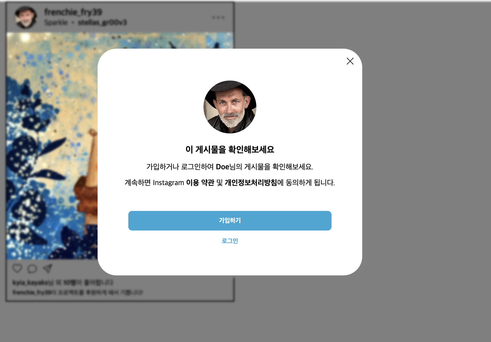
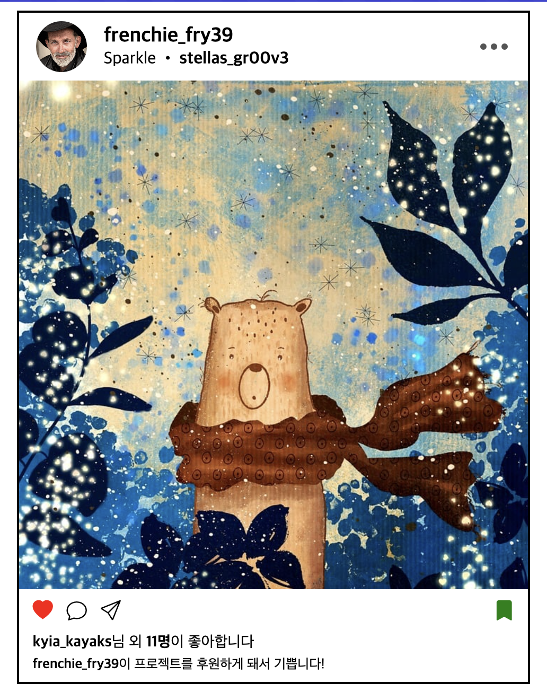

# [Day10] 25.05.21 수업 내용 정리

---

### 🛠️ 실습 내용
- [flex 실습](flexEx1.html)
- [오늘의집 실습](flexEx2.html)
- Mission
  - [인스타 피드](./instaEx.html)


---

## Flex란?
> Flex는 CSS의 `display` 속성의 확장 값 중 하나로, 요소들을 유연하게 배치할 수 있도록 도와주는 레이아웃 방식

#### 주요 개념
- **flex container** : `display: flex`가 적용된 부모 요소
- **flex item** : flex container의 자식 요소

#### 주요 속성

- [`flex`](https://developer.mozilla.org/ko/docs/Web/CSS/flex)  
  → `flex-grow`, `flex-shrink`, `flex-basis`의 단축 속성으로, 아이템의 크기 조절 방식 정의

- [`flex-grow`](https://developer.mozilla.org/ko/docs/Web/CSS/flex-grow)  
  → 컨테이너 내 남는 공간을 아이템들이 어떻게 나눌지를 결정


---
## JS


### onclick Event
> `onclick` 사용자가 HTML 요소를 클릭하면 이벤트가 발생

```html
<button onclick="alert('버튼이 클릭되었습니다!')">클릭</button>
```

### toggle()
toggle()
> 클래스의 유무에 따라 추가/제거를 반복하는 메서드   
> 주로 버튼 클릭 시 UI 토글 효과를 만들 때 사용

```js
  //하트아이콘 빨간색 클래스 추가
  element.classList.toggle("heart-red");

  //하트채우기
  element.classList.toggle("bi-heart-fill");
  element.classList.toggle("bi-heart");
```
- 하트아이콘 클릭 시, .heart-red 클래스가 붙거나 제거되어 색상이 바뀜
- 하트아이콘이 빈 아이콘과 꽉찬 아이콘 클래스가 붙거나 제거됨