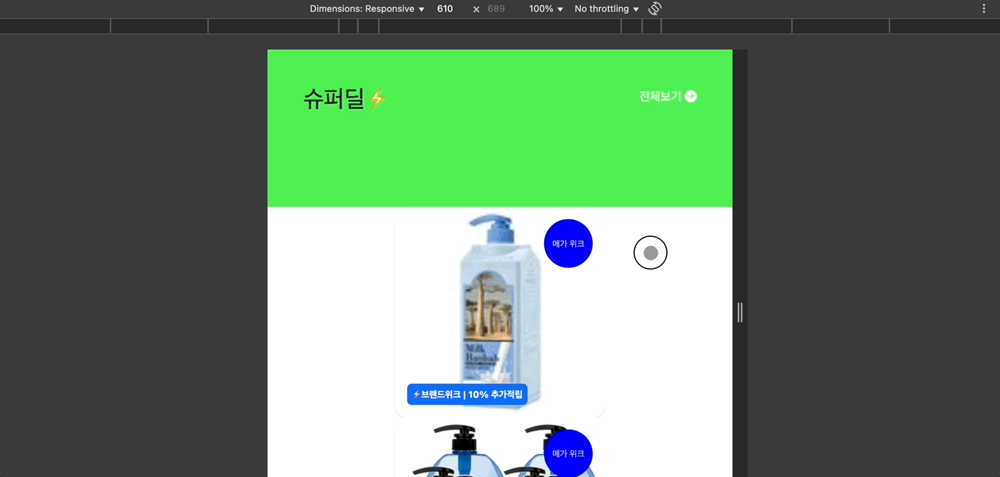
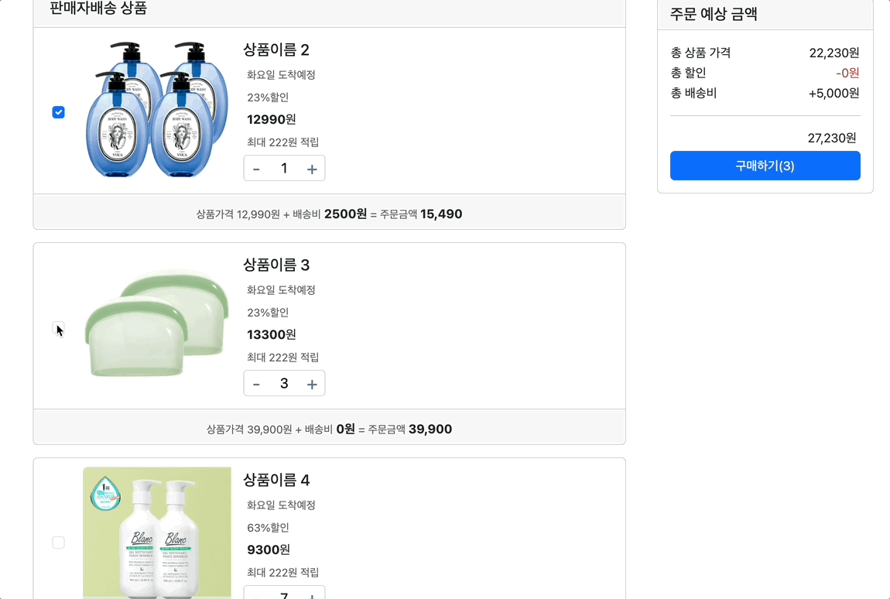

# [Day11] 25.05.22 수업 내용 정리

---

### 👩‍💻실습
- [bootstrap 실습1](./BootstrapEx/bootstrapEx1.html)
- [bootstrap 실습2](./BootstrapEx/bootstrapEx2.html)
- [포지셔닝 실습](./BootstrapEx/positionTest.html)


- [쿠팡장바구니 클론코딩](./BootstrapEx/coupangEx1.html)


---
## CSS 우선순위!


---
## 부트스트랩?
> 프론트엔드 툴킷
[부트스트랩 공식홈페이지 바로가기](https://getbootstrap.kr/docs/5.3/getting-started/introduction/)

### 부트스트랩 사용방법
1. html 파일을 생성하고, 모바일에서의 적절한 반응형 동작을 위해  `<meta name="viewport">`를 넣음
```html
<!doctype html>
<html lang="en">
  <head>
    <meta charset="utf-8">
    <meta name="viewport" content="width=device-width, initial-scale=1">
    <title>부트스트랩 실습</title>
  </head>
  <body>
    <h1>Hello, world!</h1>
  </body>
</html>
```
2. 부트스트랩 CSS와 JS 다운로드 혹은 CDN 삽입
```html
<!doctype html>
<html lang="en">
  <head>
    <meta charset="utf-8">
    <meta name="viewport" content="width=device-width, initial-scale=1">
    <title>부트스트랩 실습</title>
    <link href="https://cdn.jsdelivr.net/npm/bootstrap@5.3.6/dist/css/bootstrap.min.css" rel="stylesheet" integrity="sha384-4Q6Gf2aSP4eDXB8Miphtr37CMZZQ5oXLH2yaXMJ2w8e2ZtHTl7GptT4jmndRuHDT" crossorigin="anonymous">
  </head>
  <body>
    <h1>Hello, world!</h1>
        <script src="https://cdn.jsdelivr.net/npm/bootstrap@5.3.6/dist/js/bootstrap.bundle.min.js" integrity="sha384-j1CDi7MgGQ12Z7Qab0qlWQ/Qqz24Gc6BM0thvEMVjHnfYGF0rmFCozFSxQBxwHKO" crossorigin="anonymous"></script>
  </body>
</html>
```
---

### container 사용
[부트스트랩 container 관련](https://getbootstrap.kr/docs/5.3/layout/containers/)
- `.container`: 고정 폭의 레이아웃을 생성합니다. 반응형으로 화면 크기에 따라 최대 너비가 변경됩니다.
- `.container-fluid`: 항상 100% 너비를 유지합니다.
- `.container-{breakpoint}`: 특정 뷰포트 크기 이상일 때 고정 폭으로 설정할 수 있습니다.
  - 예: `.container-md`, `.container-lg`


### 캐러셀(carousel) 사용
[부트스트랩 캐러셀 관련](https://getbootstrap.kr/docs/5.3/components/carousel/)
- 이미지 슬라이드를 만들 때 유용함
- `id="carouselExample"`와 같은 식별자를 기준으로, `.carousel-inner`에 여러 `.carousel-item`을 넣음
- 슬라이드 자동 전환, 좌우 버튼, 인디케이터(작은 점) 등을 제공
```html
<div id="carouselExample" class="carousel slide">
  <div class="carousel-inner">
    <div class="carousel-item active">
      
    </div>
    ...
  </div>
  <button class="carousel-control-prev" ... ></button>
  <button class="carousel-control-next" ... ></button>
</div>
```

### 카드 사용
[부트스트랩 카드 관련](https://getbootstrap.kr/docs/5.3/components/card/)
- 상품, 프로필, 뉴스 등 다양한 콘텐츠를 박스형으로 보여줄 때 사용
- `.card`, `.card-body`, `.card-title`, `.card-text`, `.card-img-top` 등의 클래스로 구성
```html
<div class="card" style="width: 18rem;">
  
  <div class="card-body">
    <h5 class="card-title">제목</h5>
    <p class="card-text">내용</p>
    <a href="#" class="btn btn-primary">버튼</a>
  </div>
</div>
```


---
## CSS

### 요소 고정 - `position: fixed`, `position: sticky`

- `position: fixed`
  - 화면 기준으로 위치가 고정
  - 스크롤해도 항상 같은 위치에 머무름 (ex. 상단 내비게이션 바)
```css
.fixed-top {
  position: fixed;
  top: 0;
  width: 100%;
}
```

- `position: sticky`
  - 스크롤 위치에 따라 고정되는 효과
  - 특정 위치까지는 자연스럽게 스크롤되다가, 해당 위치에 도달하면 고정됨
  - 부모요소에 `overflow: hidden`이 되어있을 때 적용이 안 될 수 있음
  - `top`을 설정 해 주어야 함
```css
.sticky-section {
  position: sticky;
  top: 20px; /* 고정 시작 시점 */
}
```

### 🏞️ CSS 이미지 핸들링
#### object-fit / background-size 비교
> 💡 참고:
- object-fit은 , <video>, <iframe> 같은 요소에 사용됩니다.
- background-size는 CSS 배경 이미지에 사용됩니다.


| 속성        | `object-fit` 동작 설명                                   | `background-size` 동작 설명                                  |
| --------- | ---------------------------------------------------- | -------------------------------------------------------- |
| `cover`   | 요소의 콘텐츠(주로 이미지)를 비율을 유지한 채로 요소의 크기를 가득 채움. 잘릴 수 있음.  | 배경 이미지를 요소의 크기를 가득 채우도록 확대/축소. 비율 유지. 잘릴 수 있음.           |
| `contain` | 콘텐츠가 요소 내부에 완전히 들어가도록 축소 또는 확대. 비율 유지. 빈 공간 생길 수 있음. | 배경 이미지가 요소 내부에 전부 들어가도록 조정. 비율 유지. 전체가 보이지만 여백이 생길 수 있음. |
| `fill`    | 콘텐츠의 가로세로를 요소에 맞춤. 비율 무시. 왜곡될 수 있음.                  | 해당 없음 (`background-size`에는 `fill`이라는 값이 없음)              |
| `none`    | 콘텐츠 원래 크기 유지. 요소보다 클 경우 넘칠 수 있음.                     | 배경 이미지를 원래 크기로 유지. 요소보다 작거나 크면 반복되거나 잘릴 수 있음.            |


### 화면에 요소를 가운데에 정렬
> `position: absolute`를 했을 때 요소를 가운데 정렬하기

- [포지셔닝 연습 html](./BootstrapEx/positionTest.html)
- [포지셔닝 연습 css](./css/positionText.css)

#### 1. `transform` 추가
```css
.main-cards {
  position: absolute;
  display: flex;
  top: 50%;
  left: 50%;
  transform: translate(-50%, -50%);
  justify-content: center;
  align-items: center;
  gap: 1rem;
}
```

#### 2. 부트스트랩 유틸리티 사용
```html
<div class="d-flex justify-content-center align-items-center vh-100">
  <div class="main-cards">
    ...
  </div>
</div>
```
- `vh-100`: 높이를 화면(viewport) 전체로
- `d-flex`: flex 컨테이너
- `justify-content-center`: 가로 정렬
- `align-items-center`: 세로 정렬
- 이 방식은 위의 html 구조를 바꾸어야해서 포기함🥲


| 방식                                | 정중앙 정렬 가능여부 | 특징              |
| ---------------------------------- | ---------- | --------------- |
| `position: absolute` + `transform` | 완전 정중앙   | 직접 제어 가능, 정밀함   |
| 부트스트랩 유틸리티                     | 반응형 좋음   | 부트스트랩 의존, 코드 간결 |


