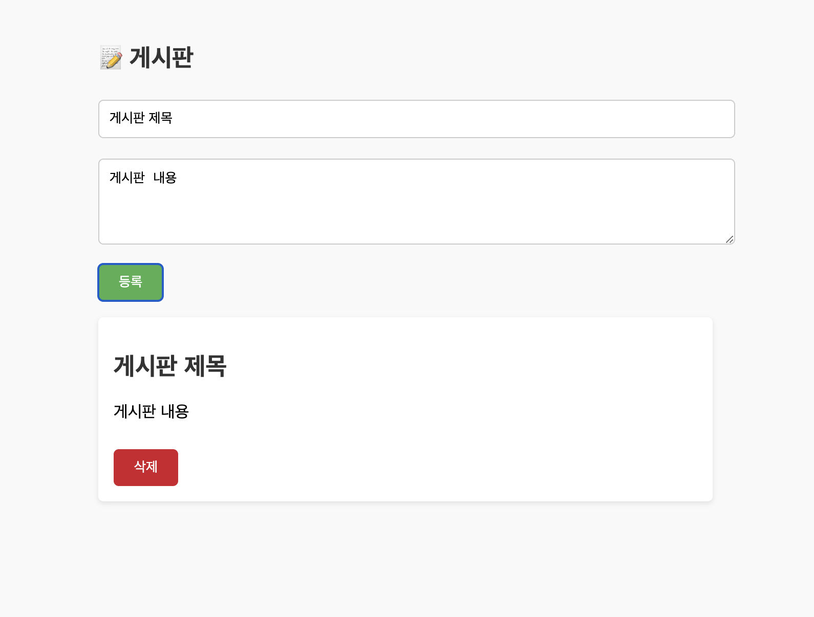
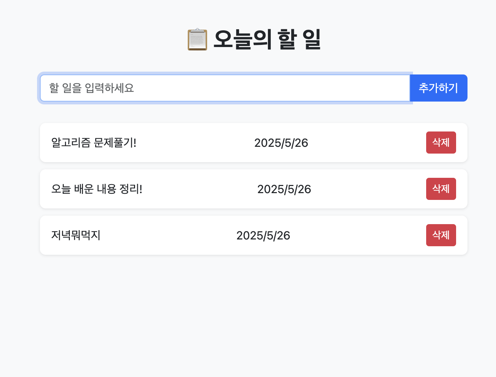

# [Day13] 25.05.26 수업내용 정리

---

### 🔗 실습 내용 
- Js 배열, 태그로 값 읽기 실습
  - [html](./html/javascriptEx1.html), [js](./js/javascriptEx1.js)
- Js로 HTML 안에 요소 만들기
  - [html](./html/javascriptEx2.html), [js](./js/javascriptEx2.js)
- 게시판 실습
  - [html](./html/testEx1.html), [js](./js/testEx1.js)
  
- Todo 실습
  - [html](./html/testEx2.html), [js](./js/testEx2.js)
  


---

# JavaScript (JS)

### ✔️ 참고
> JS의 변수는 값에 따라 메모리 공간의 타입이 자동으로 결정됨

---

## 📦 JS 배열
> 여러 개의 데이터를 순서대로 저장할 수 있는 자료형

### 📌 `.getElementsByTagName`
> HTML 문서에서 특정 태그명을 기준으로 요소들을 모두 가져옴  
> 가져온 결과는 배열 형태의 유사 배열 객체(NodeList)

```js
let pBox = document.getElementsByTagName('p'); // 모든 p 태그를 배열로 가져옴
```

---

### 배열 활용

#### 🔢 배열 길이 구하기
> `배열.length` : 배열의 총 요소 개수 반환

```js
let fruitsBox = ['사과','딸기','바나나'];
let arrayLength = fruitsBox.length; 
console.log(arrayLength); //=> 3
```

---

#### 📖 배열 값 읽기
> `배열[인덱스]` : 특정 인덱스에 있는 값을 읽음

```js
let fruitsBox = ['사과','딸기','바나나'];
console.log(fruitsBox[0]); // '사과'
```
✅ 배열은 **0번째 인덱스부터 시작**한다!

---

#### ➕ 배열 값 추가하기
- `push(value)` : 배열 **끝에** 요소 추가  
- `unshift(value)` : 배열 **앞에** 요소 추가  
- `splice(index, deleteCount, newItem)` : 기존 요소 제거/교체 또는 **중간에** 새 요소 추가

```js
let fruitsBox = [];
fruitsBox.push("딸기");       // ['딸기']
fruitsBox.unshift("바나나");  // ['바나나', '딸기']
fruitsBox.splice(2, 0, '망고'); 
// 결과: ['바나나', '딸기', '망고']
```

---

#### ✏️ 배열 값 수정하기
> 특정 인덱스의 값을 새 값으로 바꾸기

```js
let fruitsBox = ['바나나','딸기','사과','수박'];
fruitsBox[0] = '복숭아'; 
fruitsBox.splice(2, 1, '포도'); 
// 결과: ['복숭아', '딸기', '포도', '수박']
```

---

#### ❌ 배열 값 삭제하기
- `delete 배열[인덱스]` : 값만 삭제하고 **빈칸 유지**
- `splice(index, deleteCount)` : 해당 인덱스부터 지정 개수만큼 제거하며 배열 크기도 줄어듦

```js
let fruitsBox = ['바나나', '딸기','사과','수박'];
delete fruitsBox[1];
// 결과: ['바나나', empty, '사과', '수박']

fruitsBox.splice(1, 1);
// 결과: ['바나나', '사과', '수박']
```

---

## 🔍 if 문
> 조건에 따라 코드를 다르게 실행하고 싶을 때 사용

### 구문
```js
if (조건) {
  실행문1
} else {
  실행문2
}
```

- **조건** : 참/거짓으로 평가되는 표현식  
- **실행문1** : 조건이 참일 때 실행  
- **실행문2** : 조건이 거짓일 때 실행

---

### 예시
```js
let inputTag = document.getElementsByTagName('input');
let inputText = inputTag[0].value;

if (inputText !== "") {
  fruitsBox.push(inputText); 
}
```
> `input`에 값이 있을 경우에만 `fruitsBox` 배열에 추가

---

## 🛠️ JS에서 요소 만들기

### `document.createElement(요소이름)`
> 새로운 HTML 요소 생성

```js
let pTag = document.createElement('p'); // <p> 태그 생성
```

---

### `HTMLElement.innerText`
> 요소 내부의 **렌더링된 텍스트**를 설정하거나 반환

```js
pTag.innerText = "안녕하세요!";
```

🔸 `innerText`는 화면에 **보이는 텍스트** 기준  
🔸 `textContent`는 **HTML 구조 상 텍스트 전체** 기준

---

### `appendChild()`
> 생성한 요소를 기존 요소에 **자식으로 추가**

```js
document.body.appendChild(pTag); // pTag를 body에 추가
```

> `appendChild`를 이용해 원하는 위치에 동적으로 요소를 삽입할 수 있음

---

#### ✅ 예제
자세한 예제는 [JS로 HTML 안에 요소 만들기](#-실습-내용)에서 확인 가능

---

## 🔘 버튼 이벤트

### `onclick`
> HTML에서 직접 속성으로 지정  
> 단 하나의 이벤트만 연결 가능

```html
<button onclick="myFunction()">버튼</button>
```

---

### `addEventListener('이벤트', 실행함수)`
> 한 요소에 **여러 이벤트**를 연결 가능  
> 더 유연하고 유지보수가 쉬운 방식

```js
button.addEventListener('click', function() {
  alert("버튼 클릭됨!");
});
```

#### 자주 쓰는 이벤트 종류
- `click` : 클릭할 때  
- `mouseover` : 마우스가 올라갈 때  
- `keydown` : 키를 눌렀을 때  
- `blur` : 포커스가 사라질 때  
- `focus` : 포커스가 생길 때

---

### ⚠️ 에러사항
> `<input type="text" >`에 엔터키를 누르는 동작이랑 버튼을 누르는 동작을 같이 실행하고 싶어서 위에 `addEventListener('keydown', ())`을 주었는데,    
> 한글을 사용했을 때 keydown 이벤트가 2번 발생을 하는 이슈가 있었다!

#### 원인
- 찾아보니, 한글이 자음과 모음이 합쳐지는 과정에서 입력중임을 나타내는 `isComposing`상태가 된다.
- 이 상태에서 다른 키(엔터, 컨트롤 등)가 입력되면, 한 글자로 인식이 되어 `enter`가 두 번 동작하게 된다.

#### 해결방법
- `isComposing` 상태일 때 무시하는 코드를 한 줄 추가 해주었다.
```js
if(event.isComposing) return;
```

---