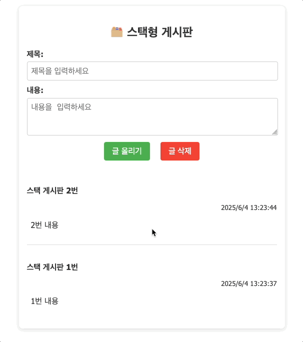

# [Day19] 25.06.04 수업 내용 정리

---

### 실습 파일

- Stack & Queue
  - [시각화 html](./algorithm/datastructure1.html)
  - [스택, 큐 활용 js](./algorithm/js/datastructure1.js)
  - [객체 스프레드 js](./algorithm/js/spreadOp.js)
- Map
  - [map 시각화 html](./algorithm/datastructure1.html)
  - [map 활용 js](./algorithm/js/map.js)
- 스택을 이용한 게시판
  - [스택 활용 게시판 html](./board/html/boardMain.html)
  - [스택 활용 게시판 js](./board/js/boardMain.js)
  - 

---

# 알고리즘 / 자료구조 시각화

## ✅ 개념 정리

### 자료구조 (Data Structure)

- 데이터를 어떤 방식으로 저장하고 불러올지에 대한 구조
- 예: 스택(Stack), 큐(Queue), 배열, 객체 등

### 알고리즘 (Algorithm)

- 데이터를 어떤 순서와 방식으로 처리할지에 대한 절차
- 예: 정렬, 탐색, 순회 등

> 프론트엔드 개발은 단순히 UI를 만드는 것을 넘어,
>
> **사용자가 효율적으로 앱을 사용할 수 있도록** 알고리즘과 자료구조를 잘 활용하는 것이 중요!

---

## Stack(스택)

> 나중에 넣은 것이 먼저 나오는 구조
>
> **Last In First Out (LIFO)**
>
> 실행취소, 브라우저 뒤로가기 등에 활용됨

### 구현방법

```js
let history = [];

function addHandler() {
  const value = prompt('추가할 값을 입력: ');
  if (value) add(value);
}

function add(value) {
  history.push(value);
  renderStack();
}

function undo() {
  if (history.length === 0) {
    alert('되돌릴 작업이 없습니다!');
    return;
  }
  const removed = history.pop();
  renderStack();
  alert(`삭제한 데이터: ${removed}`);
}

function renderStack() {
  const stackView = document.getElementById('historyBox');
  stackView.innerHTML = '';

  [...history].reverse().forEach((item) => {
    const div = document.createElement('div');
    div.className = 'stack-item';
    div.textContent = item;
    stackView.appendChild(div);
  });
}
```

---

## Queue (큐)

> 먼저 들어간 것이 먼저 나오는 구조
>
> First In First Out (FIFO)
>
> 줄서기, 알림 처리 등에 활용됨

### 구현 방법

```js
let queue = [];

function addQueueHandler() {
  const value = prompt('값을 입력해주세요');
  if (value) {
    queue.push(value);
    renderQueue();
  }
}

function renderQueue() {
  const queueBox = document.getElementById('queueBox');
  queueBox.innerHTML = '';

  queue.forEach((item) => {
    const div = document.createElement('div');
    div.className = 'queue-item';
    div.textContent = item;
    queueBox.appendChild(div);
  });
}

function removeQueue() {
  if (queue.length === 0) {
    alert('삭제할 요소가 없습니다.');
    return;
  }
  const removeData = queue.shift();
  renderQueue();
  alert(`${removeData} 가 삭제되었습니다.`);
}
```

---

## Spread 연산자 (`...`)

> 배열이나 객체 내부의 값을 펼쳐서 복사하거나 합칠 수 있음

### 배열 예시

```js
const arr1 = [1, 2, 3];
const arr2 = [4, 5];

const arr3 = [...arr1, ...arr2];
console.log(arr3); // [1, 2, 3, 4, 5]
```

### 배열에 요소 추가

```js
const fruits = ['🍊', '🍇', '🍎'];
const newFruits = ['🍋‍🟩', ...fruits, '🍑'];
console.log(newFruits); // ['🍋‍🟩', '🍊', '🍇', '🍎', '🍑']
```

### 객체 복사 및 병합

```js
const user = { name: '짱구', age: 5 };
const userCopy = { ...user, city: '떡잎마을' };
console.log(userCopy); // {name: '짱구', age: 5, city: '떡잎마을'}
```

### 스프레드가 중요한 이유?

- 원본 데이터 수정 없이 **안정적으로 복사**
- 자바스크립트에서 상태를 다룰 때 자주 사용됨

```js
const arr4 = [1, 2, 3];
const arr5 = arr4;
arr5.push(4);
console.log(arr4); // [1, 2, 3, 4] ← 원본도 바뀜

// 스프레드 사용
const arr6 = [1, 2, 3];
const arr7 = [...arr6];
arr7.push(4);
console.log(arr6); // [1, 2, 3]
console.log(arr7); // [1, 2, 3, 4]
```

---

## Map 함수

> 배열 요소를 순회하며 새로운 배열을 생성 (원본은 그대로)

### 예제 1 : 숫자 \* 2

```js
let numbers = [1, 2, 3];

// Map 없이
let doubled = [];
for (const num of numbers) {
  doubled.push(num * 2);
}

// Map 사용
let mapNumbers = numbers.map((num) => num * 2);
console.log(mapNumbers); // [2, 4, 6]
```

### 예제 2 : 이모지 추가

```js
let fruits = ['사과', '바나나', '포도'];
let copyFruits = fruits.map((fruit) => '😍' + fruit);
console.log(copyFruits); //['😍사과', '😍바나나', '😍포도']
```

### 예제 3 : 이름에 번호 붙이기

```js
let names = ['홍길동', '유관순', '이순신', '세종', '심청이'];

let copyNames = names
  .map((name, index) => `<li>${index + 1}. ${name}</li>`)
  .join('');

document.getElementById('list').innerHTML = copyNames;
```

---
