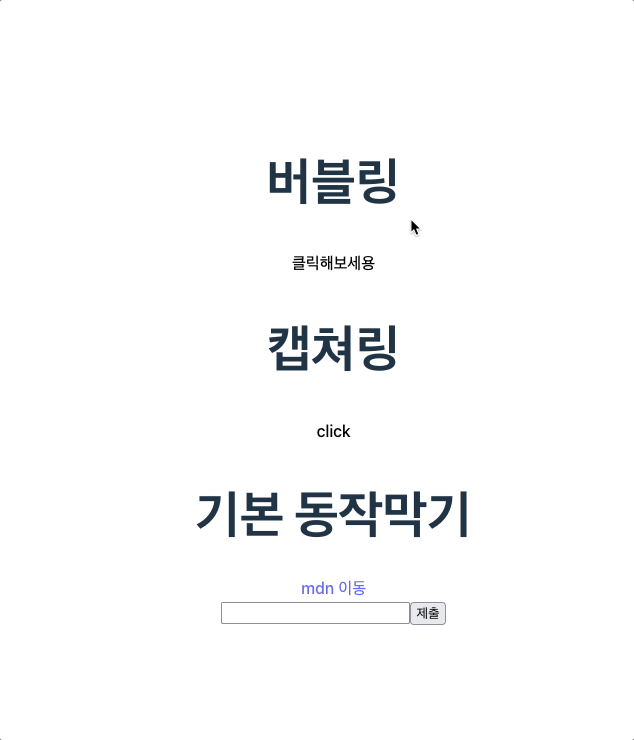

## day23-react

> 오전 수업 때 한 실습들

---

## 컴포넌트 소개

- [EventBubbling.jsx](./src/components/EventBubbling.jsx)
  - js의 버블링에 대해 알아보고, 버블링을 막는 실습 진행
- [EventBubbling2.jsx](./src/components/EventBubbling2.jsx)
  - js의 캡쳐링 관련 실습
- [EventBubbling3.jsx](./src/components/EventBubbling3.jsx)
  - 링크 이동이나 폼 제출같은 동작을 할 때, 동작을 막는 메서드 실습 진행

- [ReactHookFormEx1.jsx](./src/components/ReactHookFormEx1.jsx)

  - 약간의 정규식
  - `react-hook-form` 사용

- [EventDelegationEx.jsx](./src/components/EventDelegationEx.jsx)
  - 이벤트 위임
