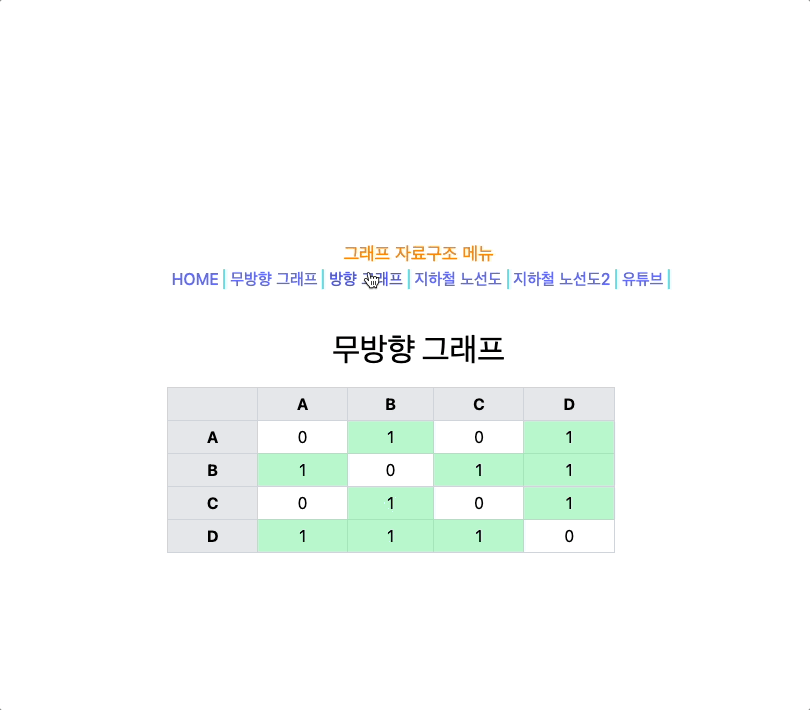
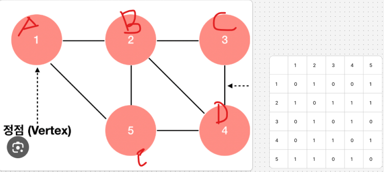
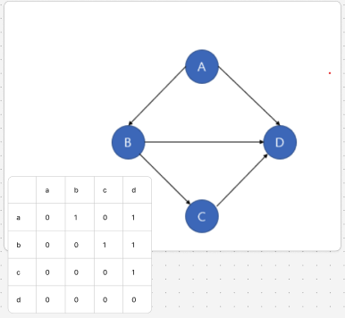

# \[Day35] 2025.06.27 학습 내용 정리

---

### 💻 실습 이미지



---

## 📌 자료 구조: 그래프(Graph)

그래프는 각 노드(Node)가 하나 이상의 다른 노드와 연결되어 있는 구조입니다. 다양한 분야에서 활용됩니다:

- 네트워크 구조
- 추천 시스템
- 경로 탐색
- 소셜 미디어 관계도 등

### 🔹 구성 요소

- **정점(Node)**: 데이터 단위
- **간선(Edge)**: 정점 간 연결

### 🔹 주요 라이브러리

- 시각화: `vis-network`, `d3.js`
- 연산 및 UI: `graphlib`, `cytoscape.js`

---

## 📌 그래프 구현 방법

| 구분     | 인접 행렬                                     | 인접 리스트                             |
| -------- | --------------------------------------------- | --------------------------------------- |
| **방식** | 2차원 배열로 노드 간 연결을 1 또는 0으로 표현 | 리스트 배열로 연결된 노드만 저장        |
| **장점** | 구현이 쉬움                                   | 메모리 효율적                           |
| **단점** | 공간 낭비                                     | 구현 복잡도 높고 연결 확인 시 시간 소요 |

### 💡 배열 예시 (참고)

```js
const arr = [1, 2, 3, 4, 5]; // 1차원 배열

const arr2 = [
  [1, 2, 3, 4],
  [5, 6, 7, 8],
]; // 2차원 배열
```

---

## 📌 그래프의 종류

### 🔸 무방향 그래프 (Undirected Graph)

- 간선에 방향이 없음
- 인접 행렬을 사용해 두 노드가 연결되어 있으면 `1`, 아니면 `0`



```js
export const nodeNames = ['A', 'B', 'C', 'D'];
export const undirectedNodes = [
  [0, 1, 0, 1],
  [1, 0, 1, 1],
  [0, 1, 0, 1],
  [1, 1, 1, 0],
];
```

```jsx
{
  undirectedNodes.map((row, i) => (
    <tr key={i}>
      <th className='border border-gray-300'>{nodeNames[i]}</th>
      {row.map((col, j) => (
        <td className={`border border-gray-300 text-center ${col ? 'bg-green-200' : ''}`} key={j}>
          {col}
        </td>
      ))}
    </tr>
  ));
}
```

- 연결된 노드는 초록색(`bg-green-200`) 배경 처리됨

---

### 🔸 방향 그래프 (Directed Graph)

- 노드와 방향이 있는 간선으로 구성
- 한 방향으로만 연결되며, 반대방향은 보장되지 않음



```jsx
<ul>
  {subwayNames.map((station, i) => (
    <li key={i}>
      <strong>{station}</strong> ➡️ 연결된 역 :{' '}
      {subwayList[i]
        .map((isConnected, j) => (isConnected ? subwayNames[j] : null))
        .filter((name) => name !== null)
        .join(', ')}
    </li>
  ))}
</ul>
```

- 각 지하철역이 어느 역과 연결되었는지 출력

---

## 📌 유튜브 검색 API 활용 실습

- [Google Cloud Platform](https://console.cloud.google.com)에서 API Key를 발급받아 사용
- 문서 참고: [YouTube 개발자 문서](https://developers.google.com/youtube/documentation?hl=ko)

### 🔹 주요 파라미터

| 매개변수 | 설명                                           |
| -------- | ---------------------------------------------- |
| `url`    | `https://www.googleapis.com/youtube/v3/search` |
| `part`   | `snippet` (응답에 포함될 리소스 속성)          |
| `q`      | 검색할 키워드 (URL 이스케이프 처리 필요)       |
| `APIKEY` | 발급받은 API 키                                |

> 더 자세한 정보: [YouTube Search API 문서](https://developers.google.com/youtube/v3/docs/search/list?hl=ko)

---
